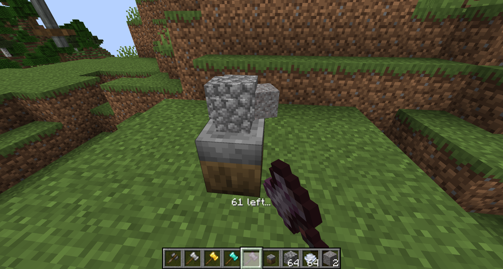
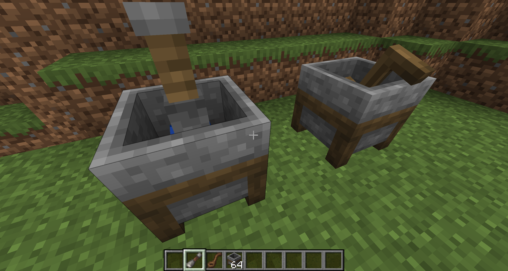
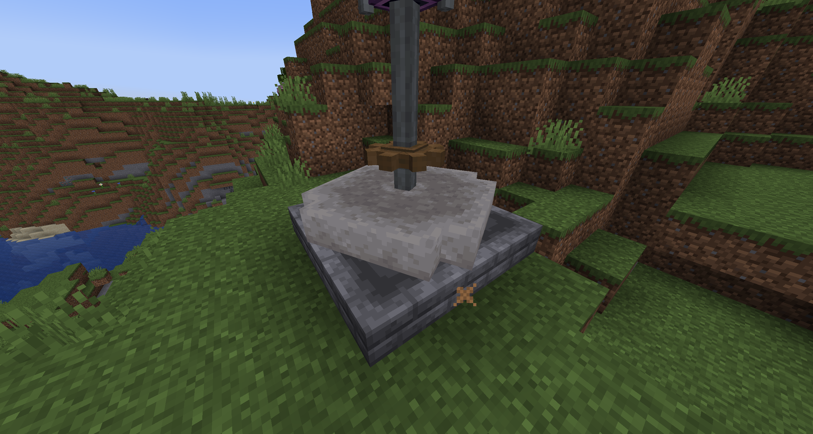
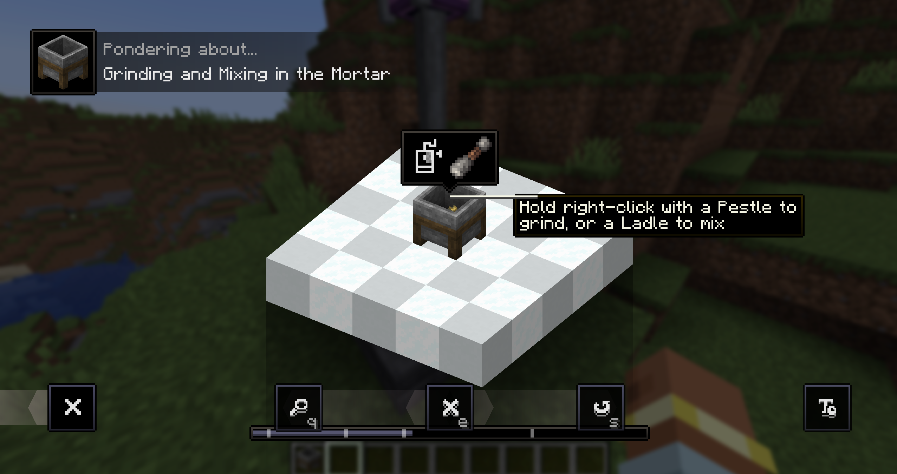

# Manual Labour

---

## Overview

Welcome to **Manual Labour**! 

This mod is all about bringing hands-on work back to your Minecraft experience. Instead of simply clicking a recipe button in a crafting table, Manual Labour lets you grind, hammer, crush, and mix your materials by hand.

Perfect for an early-game progression step before building more complex setups, or as a natural manual companion to [Create](https://modrinth.com/mod/create) machines.

---

## Features & Workstations

### The Workstone & Hammers
The **Workstone** is your primary station for hammering and shaping materials.

* **Tiered Hammers**: Craft hammers out of **Flint**, **Iron**, **Gold**, **Diamond**, or **Netherite**.
* **Forging & Crushing**: Place items directly on the Workstone and strike them to flatten ingots into plates, break down ores, or shape raw components.
* **Durability & Speed**: Higher tier hammers grant improved durability.

---

### The Mortar, Pestle & Ladle
The **Mortar** allows you to grind down ingredients and mix fluids.

* **Pestle**: Use the Pestle inside the Mortar to crush herbs, plants, minerals, and food items into powders and dyes.
* **Ladle**: Use the Ladle to manually mix mixtures and multi-ingredient recipes.

---

### The Millstone
The **Millstone** is an aesthetic alternative to the Create millstone, inspired by the Wayfarer modpack. It supports 
all the same recipes and is powered similarly to the other Create machines.

---

## Compatibility & Integrations

* **Create**: Manual Labour tools are designed as manual alternatives to Create's Mechanical Press, Mechanical Mixer, and Sequenced Assembly.
* **JEI Support**: Full recipe viewer integration for all Workstone, Mortar, and Millstone recipes. Works with EMI using [TMRV](https://modrinth.com/mod/tmrv).
* **Ponder Support**: Features interactive Ponder scenes to visually guide you through using each workstation in-game.

---

## License

* **Code**: Licensed under the [MIT License](https://github.com/evanbones/Manual-Labour/blob/1.21.1/LICENSE).
* **Assets**: All Rights Reserved (ARR).

---

## Credits

Contains code adapted from [Farmer's Delight](https://modrinth.com/mod/farmers-delight), used under its MIT license.

Project commissioned by AuroraAster.

All art, branding, and sounds by [Baileybun](https://modrinth.com/user/Baileybun)!

---

 